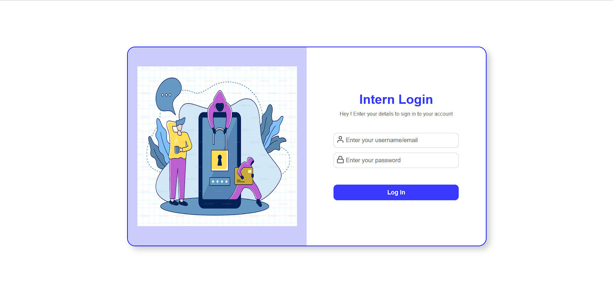
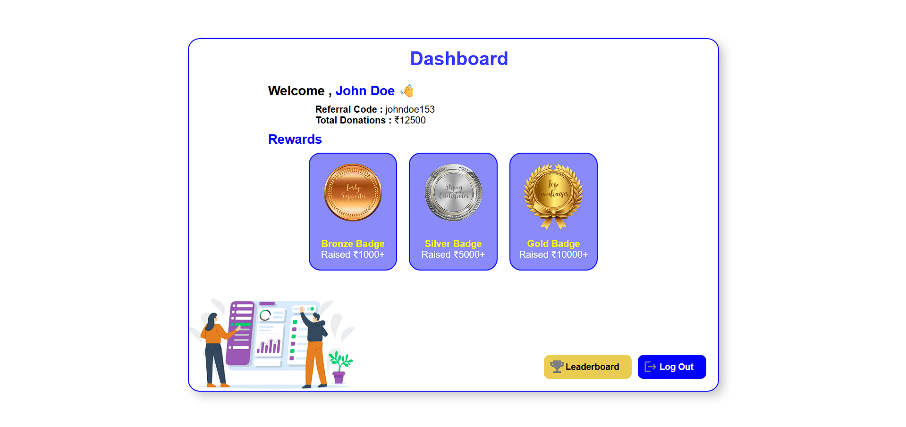
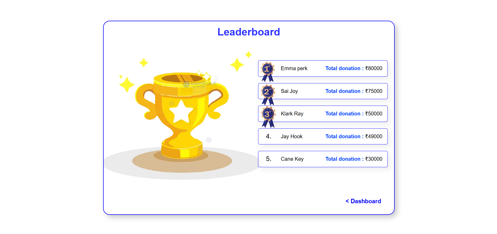

# 🌐 Intern Portal (Frontend Only)

A simple, fully responsive **Intern Dashboard** built using **React** with dummy data served from static JSON .

## 📸 Screenshots

  
  


## 🚀 Features

- 🔐 Dummy Login Page (no authentication)
- 👤 Intern Dashboard showing:
  - Intern Name
  - Referral Code
  - Total Donations Raised
  - Static Rewards Section
- 🏆 Leaderboard (from dummy data)
- 🎨 Clean, responsive UI
- 📁 Fully hosted (on Vercel)

## 🛠️ Tech Stack

- **Frontend**: React (Create React App)
- **Data**: Static `data.json` in `public/`
- **Hosting**: Vercel

## 📁 Project Structure

```
intern-portal/
│
├── public/
│   ├── images/
│   ├── data.json       # Contains intern info and leaderboard
│   └── index.html   
│          
├── src/
│   ├── components/
│   │   ├── Dashboard/    # Displays intern data + rewards
│   │   │    ├── Dashboard.css
│   │   │    └── Dashboard.jsx
│   │   │
│   │   ├── Leaderboard/       # Displays leaderboard
│   │   │    ├── Leaderboard.css
│   │   │    └── Leaderboard.jsx
│   │   │
│   │   └──  Login/             # Displays login page
│   │        ├── Login.css
│   │        └── Login.jsx
│   │   
│   ├── App.js              # Main app entry
│   └── App.css             # Basic styling
```

## 📄 Data Format

### `/public/data.json`

```json
{
  "intern": {
    "name": "John Doe",
    "referralCode": "johndoe153",
    "totalDonations": 12500,
    "rewards": [
      {
        "title": "Bronze Badge",
        "description": "Raised ₹1000+"
      },
      ...
    ]
  },
  "leaderboard": [
    {
      "name": "Emma perk",
      "donations": 80000
    },
    ...
  ]
}
```

## 🌐 Live Demo

🔗 [View Live Site on Vercel](https://your-vercel-site.vercel.app)

## 🧑‍💻 How to Run Locally

```bash
git clone https://github.com/your-username/intern-portal.git
cd intern-portal
npm install
npm start
```

## 📬 Contact

Feel free to connect on [LinkedIn](www.linkedin.com/in/suhani01) or email at `suhaninegi124@gmail.com`
